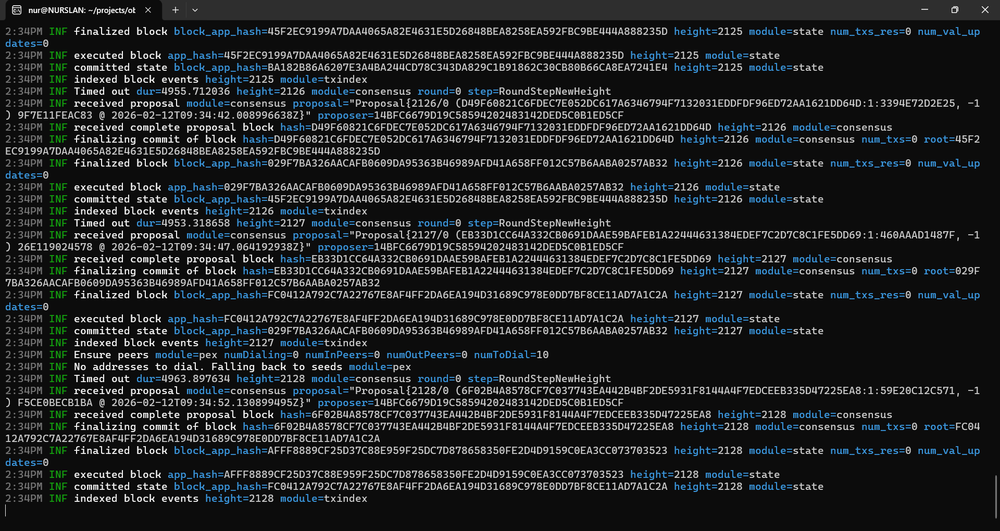

# 💎 Obsidian: LegalTech Layer-1 Blockchain

**Obsidian** is a high-performance L1 blockchain engineered on the **Cosmos SDK v0.50**, specifically designed for the **LegalTech** sector (Digital Notary, Document Verification, and Immutable Evidence).

## 🚀 Key Value Propositions

*   **Custom Notary Module**: Built-in logic for instant document hashing and cross-chain verification.
*   **🔥 25% Fee Burn Engine**: Every transaction fee (minting, sending, voting) burns **25%** of its value, creating a permanent deflationary pressure.
*   **Hard Cap Economy**: Limited supply of **500,000,000 OBS** tokens, ensuring long-term scarcity.
*   **IBC/ICA Native**: Fully compatible with the "Internet of Blockchains" for seamless data and asset transfer.

## 📊 Tokenomics (500M OBS Total Supply)

Obsidian follows a transparent, on-chain distribution model established at the Genesis block:

| Allocation Category | Share | Amount (OBS) | Strategy |
| :--- | :--- | :--- | :--- |
| **Foundation & Team** | 15% | 75,000,000 | 3-Year Vesting Schedule |
| **Community Pool** | 35% | 175,000,000 | Governance-Locked DAO Reserve |
| **Ecosystem & Grants** | 15% | 75,000,000 | Rewarding LegalTech Integrations |
| **Investors (Seed)** | 15% | 75,000,000 | Private Strategic Rounds |
| **Liquidity Reserve** | 15% | 75,000,000 | Exchange Listings & Market Making |
| **Airdrop Fund** | 5% | 25,000,000 | Community Acquisition & Hype |

## 🛡️ Deflationary Model
Obsidian is designed as **"Ultrasound Legal Money"**. The 25% burn mechanism ensures that as the legal industry adopts the network for document verification, the circulating supply of OBS decreases, increasing the fundamental value of the remaining tokens. [1.2]

## 🏛 Private Seed Round (Open)
Obsidian is currently in the **Pre-Seed** stage, offering an attractive entry point for strategic early partners.

*   **Current Phase: Strategic Pre-Seed** 🚀
    *   Target Price: **$0.02** ($10M FDV)
*   **Upcoming: Private Seed Round**
    *   Target Price: **$0.05** (2.5x Step-up)
*   **Upcoming: Public Pre-sale**
    *   Target Price: **$0.10** (2x Step-up)
*   **Listing Target:** **$0.20+** (10x Potential)
*   **Inquiries:** [sagynbeknurslan95@gmail.com]

---
*Empowering Legal Certainty with Proof-of-Stake Security.*
